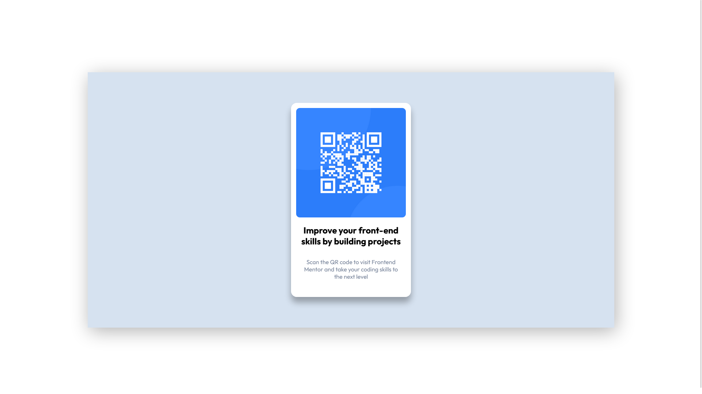

# Frontend Mentor - QR code component solution

This is a solution to the [QR code component challenge on Frontend Mentor](https://www.frontendmentor.io/challenges/qr-code-component-iux_sIO_H). Frontend Mentor challenges help you improve your coding skills by building realistic projects. 
This is my solution to the "QR component main" challenge from Frontend Mentor

## Table of contents

- [Overview](#overview)
  - [Screenshot](#screenshot)
  - [Links](#links)
- [My process](#my-process)
  - [Built with](#built-with)
  - [Useful resources](#useful-resources)
- [Author](#author)
- [Acknowledgments](#acknowledgments)

## Overview

###Screenshot
### mobile

### Desktop

## My process

### Built with

- HTML5 
- CSS
- Flexbox
- Mobile-first workflow

### Useful resources

- [MDN](https://developer.mozilla.org/en-US/docs/Learn/Front-end_web_developer) - This is an amazing article which helped me finally understand XYZ. I'd recommend it to anyone still learning this concept.

## Author
- Frontend Mentor - [@abbashcs18](https://www.frontendmentor.io/profile/abbashcs18)

